## Part 1. Установка ОС

1. Чтобы узнать версию ОС, необходимо выполнить команду:\
   `cat /etc/issue`

## Part 2. Создание пользователя

1. Создание пользователя:\
   `sudo adduser casper`

2. Добавление пользователя в группу adm:\
   `sudo usermod -aG adm casper`

3. Проверка, что пользователь успешно добавлен:\
   `cat /etc/passwd | grep casper`

## Part 3. Настройка сети ОС

1. Задаём название машины:\
   `sudo hostname user-1`

2. Установка временной зоны и проверка:\
   `sudo timedatectl set-timezone Europe/Moscow`\
   `timedatectl`

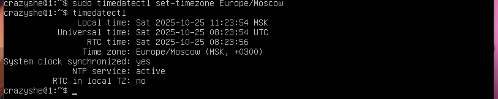

3. Вывод названий сетевых интерфейсов:\
   `ip link show`

Интерфейс 1 — lo

- Тип: loopback (виртуальный интерфейс).
- MTU: 65536 — максимальный размер пакета.
- MAC-адрес: 00:00:00:00:00:00 (не используется физически).
- Состояние: UP (активен).
- Назначение: внутренние сетевые соединения компьютера (localhost, IP 127.0.0.1).

Интерфейс `lo` используется для проверки работы сетевого стека и обмена данными внутри устройства, без выхода в сеть.

`enp0s3` — физический, обеспечивает сетевое подключение, активен и функционирует корректно.

4. Получение IP-адреса от DHCP:\
   `ip address`

DHCP — сетевой протокол, позволяющий сетевым устройствам автоматически получать IP-адрес и другие параметры, необходимые для работы в сети TCP/IP.

5. Определение внешнего и внутреннего IP-адреса шлюза:\
   `ip route`

6. Задание статичных сетевых настроек\

Для задания статического IP-адреса, шлюза и DNS, необходимо отредактировать YAML-файл в директории /etc/netplan/:\
`sudo nano /etc/netplan/00-installer-config.yaml`

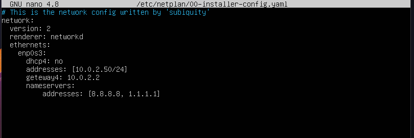

После сохранения файла и применения новых настроек, выполняем следующую команду для применения конфигурации:\
`sudo netplan apply`

7. Перезагрузка виртуальной машины:\
   `sudo reboot`

8. Проверяем, что статические настройки сохранены:\
   `ip addr show`\
   `ip route`

9. Проверяем доступность хостов командами:\
   `ping -c 10 1.1.1.1`\
   `ping -c 10 ya.ru`

## Part 4. Обновление ОС

1. Обновляем список пакетов командой:\
   `sudo apt full-update`

## Part 5. Использование команды **sudo**

1. Истинное назначение команды sudo

Команда sudo (SuperUser DO) позволяет пользователю выполнять команды с привилегиями суперпользователя (root). Это позволяет администраторам системы и другим пользователям выполнять специфические задачи, требующие повышенных привилегий, например, установку программ или изменение системных файлов.

2. Выдаём пользователю root права:\
   `sudo usermod -aG sudo casper`

3. И проверяем их наличие:\
   `sudo -l -U casper`

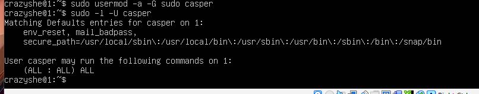

4. Переключаем пользователя на casper и меняем hostname:\
   `sudo su - casper`\
   `sudo hostname user-1`

## Part 6. Установка и настройка службы времени

1. Активируем NTP синхронизацию командой:\
   `sudo timedatectl set-ntp true`

2. Проверка настроек синхронизации времени:\
   `timedatectl show`

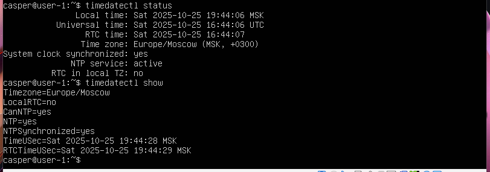

## Part 7. Установка и использование текстовых редакторов

1. Установка текстовых редакторов:\
   `sudo apt install vim`\
   `sudo apt install nano`\
   `sudo apt install mcedit`

2. Создаём и открываем файл командой:\
   `vim test_vim.txt`\
   `i` - переключение в режим ввода\
   `Esc` - переключение в командный режим\
   `:wq` ,а затем `Enter` - выход с сохранением

3. Создаём и открываем файл командой:\
   `nano test_nano.txt`\
   `Ctrl+O` - сохранение\
   `Enter` - подтверждение имени файла\
   `Ctrl+X` - выход

4. Создаём и открываем файл командой:\
   `mcedit test_edit.txt`\
   `F2` - сохраниение\
   `Enter` - подтверждение\
   `F10` - выход

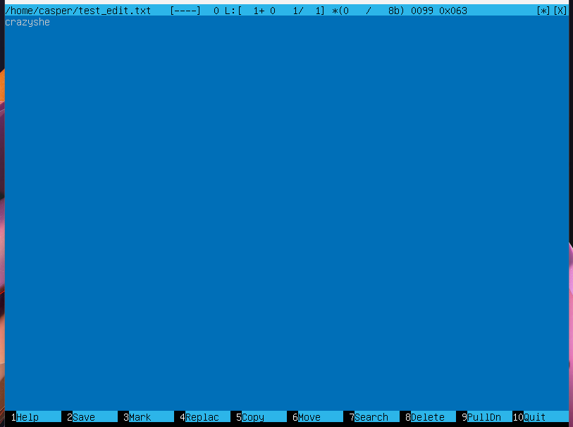

5. Редактирование и выход без сохраниения:

- vim:

  - `:q!` - выход без сохраниеня

  

- nano:

  - `Ctrl+X` + `n` - выход и отказ от сохранения

  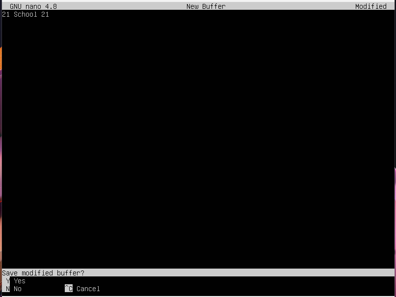

- mcedit:

  - `F10` + `[NO]` - выход и отказ от сохранения

  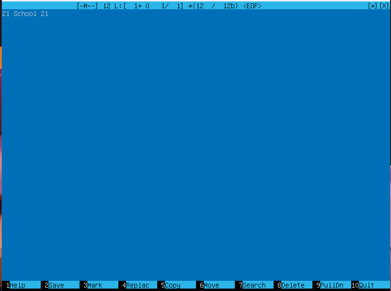

6. Поиск и замена слова:

- vim:

  - `/слово` - поиск

  

  - `:s/слово/замена` - замена

  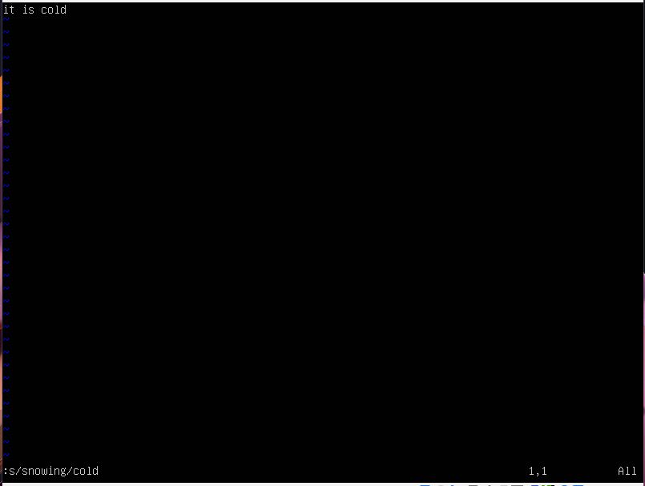

- nano:

  - `Ctrl + W` - поиск

  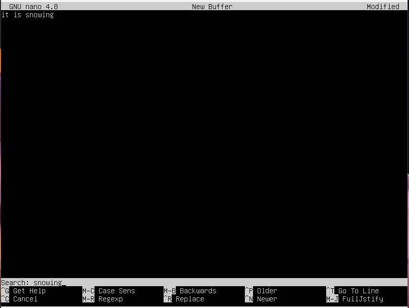

  

  - `Ctrl + \` - замена
  - `Enter`

  

  

  

- mcedit:

  - `F7` - поиск

  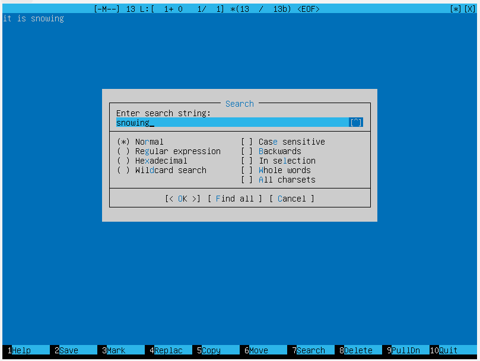

  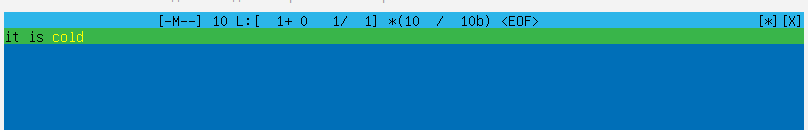

  - `F4` - замена

  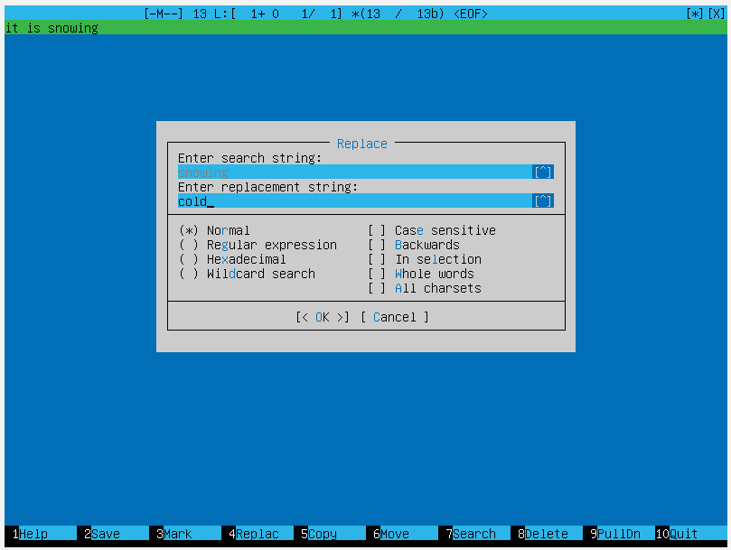

  

  

  ## Part 8. Установка и базовая настройка сервиса **SSHD**

1. Установка службы SSHD:\
   `sudo apt update`\
   `sudo apt install openssh-server`

2. Добавление автозапуска службы SSHD:\
   `sudo systemctl enable ssh`\:
   `systemctl status ssh` - проверка статуса

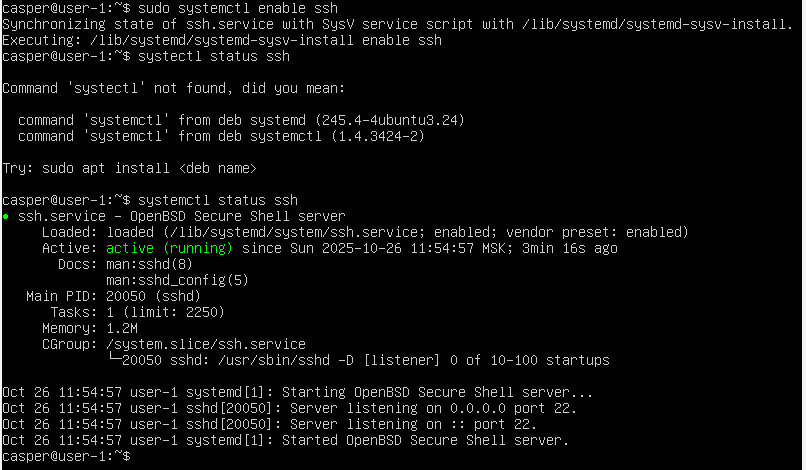

3.  Перенастройка службы SSHD на порт 2022:\
    `sudo nano /etc/ssh/sshd_config` - редактирование файла: - #Port 22 меняем на Port 2022

        `sudo systemctl restart ssh` - перезагрузка службы

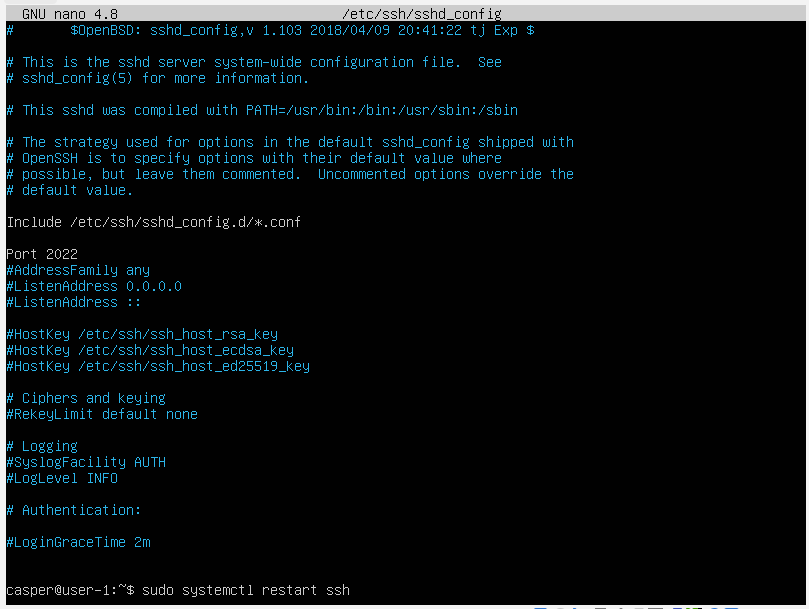

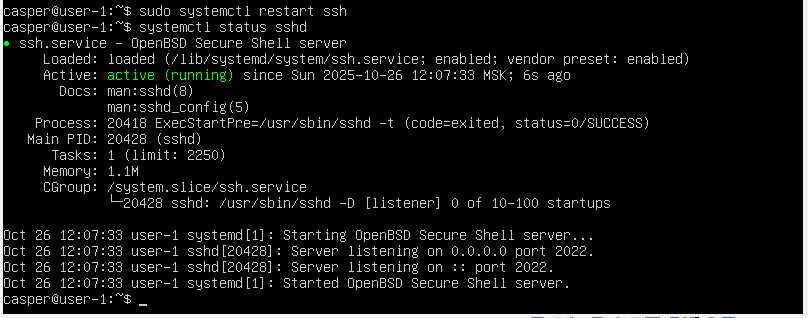

4. Проверка работы SSHD с помощью команды ps:\
   `ps -A | grep sshd`

`ps` - отображает информацию о паботающих процессах

Основные ключи команды ps:\
-e: Показывает все процессы в системе.\
-u: Показывает информацию о пользователях, запустивших процессы.\
-x: Показывает процессы, которые не связаны с терминалом.\
-f: Форматирует вывод более подробным образом, включая полный путь к исполняемому файлу и информацию о родительском процессе.\
-l: Показывает дополнительную информацию, такую как владелец процесса, группа, размер памяти и т.д.\
-a: Аналогично ключу -x, показывает процессы, не связанные с терминалом.\
-A: Показывает все процессы в системе, независимо от того, кто их запустил.\
-m: Показывает только процессы, связанные с сетью.\
-n: Не показывает процессы, которые не имеют идентификаторов процесса.\
-o: Позволяет пользователю определить формат вывода с помощью списка полей.

5. Перезагрузка системы:\
   `sudo reboot`

6. Устанавливаем netstat:\
   `sudo apt install net-tools`

Вывод комманды:\
`sudo netstat -tan`

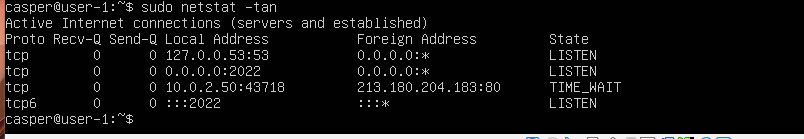

Ключ -t отображает только TCP сокеты\
Ключ -a отображает все сокеты (listening and non-listening)\
Ключ -n отображает адреса и порты вместо имен

Объяснение вывода netstat -tan:\
Proto: Протокол, используемый для соединения. Например, tcp или udp.\
tcp: Тип протокола.\
Recv-Q: Количество байтов, ожидающих прием в сокет. Это количество данных, которое еще не было прочитано приложением.\
Send-Q: Количество байтов, ожидающих отправку из сокета. Это количество данных, которое еще не было отправлено сетью.\
0 0: Стандартные значения, указывающие, что данные не отправлялись или не получены.\
Local Address: Локальный адрес и порт, на котором прослушивается соединение. 0.0.0.0 означает, что сокет прослушивает на всех доступных сетевых интерфейсах.\
0.0.0.0:2022: IP-адрес и порт, на котором прослушивается соединение. 0.0.0.0 означает, что сервер принимает соединения на указанном порту с любого IP-адреса.\
Foreign Address: Адрес и порт удаленного хоста, с которым установлено соединение. Если соединение не установлено, этот столбец может быть пустым.\
State: Состояние соединения.\
LISTEN: Состояние сокета, указывающее, что сервер готов принимать входящие соединения.\

## Part 9. Установка и использование утилит **top**, **htop**

1. Вывод команды top:\
   `sudo top`

12:16:13 up 4 min, 1 user, load average: 0.05, 0.27, 0.15

- `12:16:13` — текущее время.
- `up 4 min` — система работает 4 минуты.
- `1 user` — количество авторизованных пользователей.
- `load average (0.05, 0.27, 0.15)` — средняя загрузка системы за последние 1, 5 и 15 минут соответственно.

Tasks: 99 total, 1 running, 98 sleeping, 0 stopped, 0 zombie

- `99 total` — общее количество процессов.
- `1 running` — активный процесс.
- `98 sleeping` — процессы, находящиеся в режиме ожидания.
- `0 stopped, 0 zombie` — остановленных и “зомби”-процессов нет.

%Cpu(s): 0.0 us, 0.0 sy, 0.0 ni, 100.0 id, 0.0 wa, 0.0 hi, 0.0 si, 0.0 st

- `us (user)` — нагрузка от пользовательских процессов — 0.0%.
- `sy (system)` — нагрузка от системных процессов — 0.0%.
- `ni (nice)` — процессы с изменённым приоритетом — 0.0%.
- `id (idle)` — простаивание процессора — 100.0%.
- `wa (wait)` — ожидание операций ввода-вывода — 0.0%.
- `hi / si / st` — аппаратные и программные прерывания — 0.0%.

MiB Mem : 1971.6 total, 1451.6 free, 148.1 used, 371.9 buff/cache
MiB Swap: 2048.0 total, 2048.0 free, 0.0 used, 1669.7 avail Mem

- `1971.6 total` — общий объём оперативной памяти (MB).
- `1451.6 free` — свободная память.
- `148.1 used` — используемая память.
- `371.9 buff/cache` — используется под кэш и буферы.
- `Swap:` 2048 MB доступно, не используется.

PID USER PR NI VIRT RES SHR S %CPU %MEM TIME+ COMMAND
1 root 20 0 102672 11544 8528 S 0.0 0.6 0:01.13 systemd

- `PID 1` — главный системный процесс `systemd`.
- `USER:` root
- `PR:` 20 — приоритет процесса.
- `%CPU:` 0.0 — не использует процессор.
- `%MEM:` 0.6 — использует 0.6% оперативной памяти.
- `TIME+:` 0:01.13 — использовал 1.13 секунд процессорного времени.

2. Вывод команды htop:\
   `sudo htop`\
   `F6` - сортировка

- сортировка по PID

- PERCENT_CPU

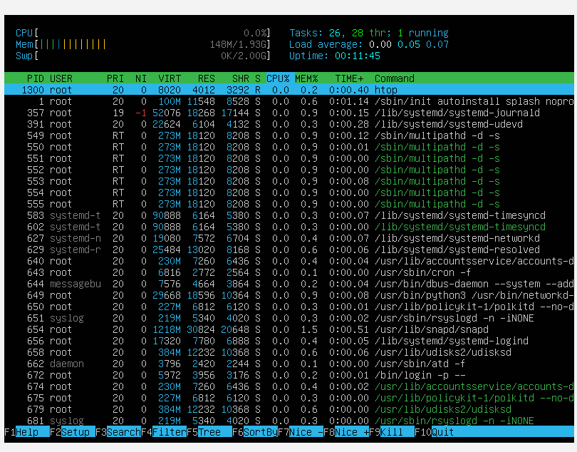

- PERCENT_MEM

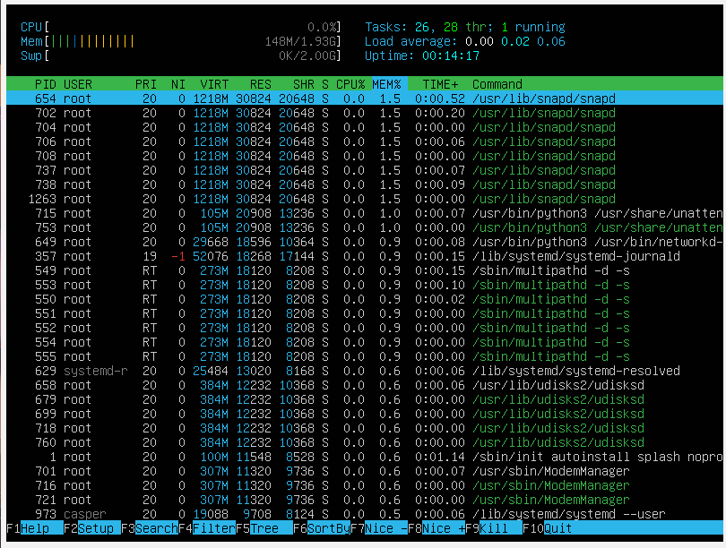

- TIME

- фильтр для процесса sshd

`F4`

- с процессом syslog, найденным, используя поиск

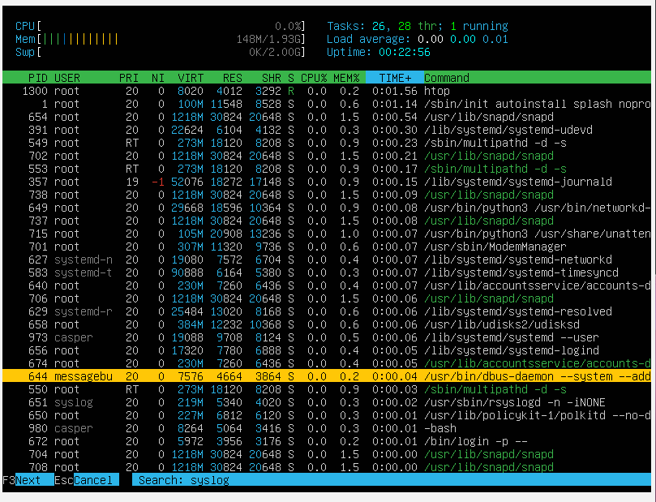

- с добавленным выводом hostname, clock и uptime

`F2`

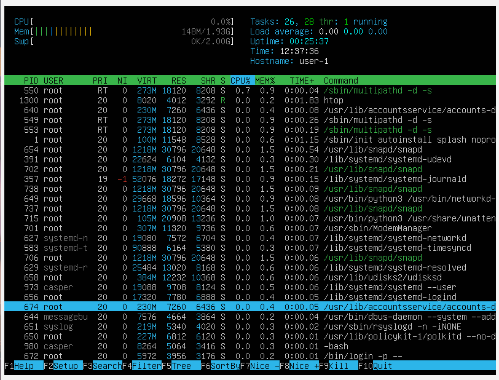

## Part 10. Использование утилиты **fdisk**

1. Выполняем команду:\
   `sudo fdisk -l`

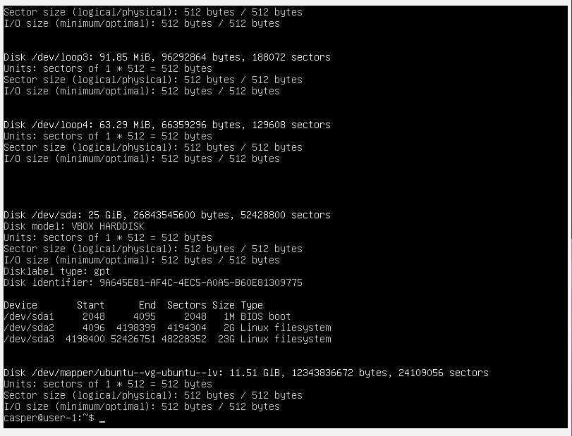

Общие сведения

- `Название устройства:` /dev/sda
- `Модель:` VBOX HARDDISK
- `Тип таблицы разделов:` GPT
- `Размер диска:` 25 GiB
- `Количество секторов:` 52,428,800
- Размер сектора:` 512 байт (логический и физический)

Разделы диска
| Устройство | Начало | Конец | Размер | Тип |
|-------------|--------|-------|--------|-----|
| /dev/sda1 | 1 | 2047 | 1M | BIOS boot |
| /dev/sda2 | 2048 | 4198399 | 2G | Linux filesystem |
| /dev/sda3 | 4198400 | 52426751 | 23G | Linux filesystem |

Дополнительная информация

- `Swap-пространство:` 2.0 ГБ
- `Логический том (LVM):` /dev/mapper/ubuntu--vg-ubuntu--lv
  - `Размер:` 11.51 GiB
  - `Количество секторов:` 24,109,056
  - `Размер сектора:` 512 байт

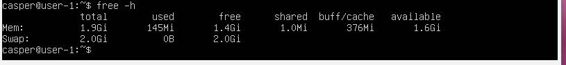

## Part 11. Использование утилиты **df**

1. `sudo df`

- Файловая система: /dev/mapper/ubuntu--vg-ubuntu--lv
- Размер раздела: 11 758 760 килобайт
- Занято: 4 863 564 килобайт
- Свободно: 6 276 068 килобайт
- Процент использования: 44 %
- Точка монтирования: /
- Единица измерения: килобайт

2. `sudo df -Th`

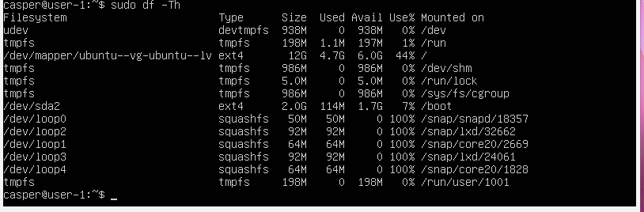

- Размер раздела: 12 ГБ
- Размер занятого пространства: 5.3 ГБ
- Размер свободного пространства: 5.5 ГБ
- Процент использования: 50%
- Тип файловой системы: ext4

## Part 12. Использование утилиты **du**

1. `du`

2. Размер папок /home, /var, /var/log (в байтах, в человекочитаемом виде)\
   `sudo du -hsb /var`\
   `sudo du -hsb /var/log`\
   `sudo du -hsb /home`

- -s — (summarize) выводит только общий размер каталога, без размеров вложенных папок.

- -b — (bytes) показывает размер в байтах, без перевода в килобайты или мегабайты.

- -h — (human-readable) делает вывод человекочитаемым (например, KB, MB, GB).

3. Размер всего содержимого в /var/log\
   `sudo du -h /var/log/*`

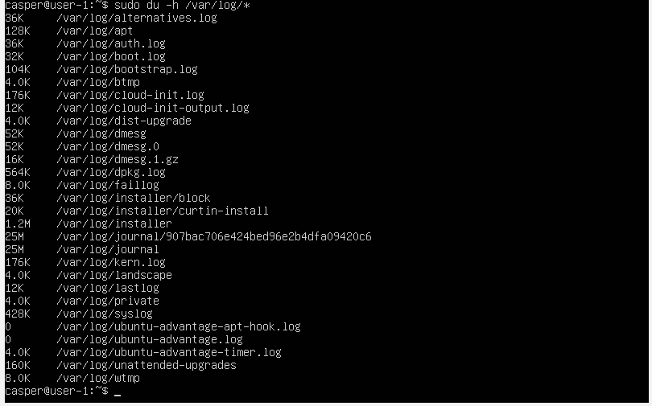

## Part 13. Установка и использование утилиты **ncdu**

1. Установка утилиты:\
   `sudo apt install ncdu`

2. Вывод размера папок /home, /var, /var/log:

`ncdu /home`

`ncdu /var`

`ncdu /var/log`

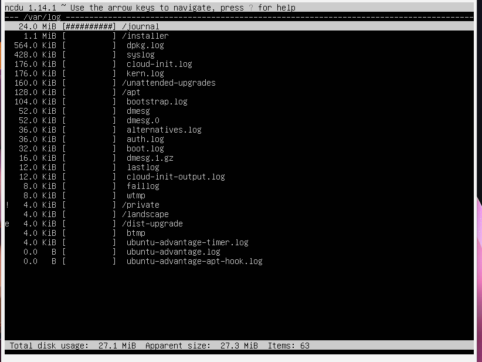

## Part 14. Работа с системными журналами

1. Для просмотра логов вводим команды:

`cat /var/log/dmesg` - содержит сообщения ядра Linux, включая информацию о загрузке оборудования и других низкоуровневых событий\
`cat /var/log/syslog` - содержит системные сообщения, включая информацию о работе служб и приложений\
`cat /var/log/auth.log ` - содержит информацию о событиях аутентификации, включая попытки входа в систему и успешные авторизации

2. Последняя успешная авторизация:

`cat /var/log/auth.log | grep 'session opened'`

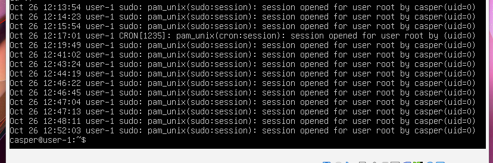

- Дата и время: начиная с 26 октября 12:13:54 по 12:52:03.
- Имя пользователя: casper.
- Хост: user-1.
- Метод: sudo — запуск команд с повышением привилегий.
- Сообщение: session opened for user root by casper(uid=0) — означает, что пользователь casper открыл сессию с правами суперпользователя (root).
- (uid=0): идентификатор пользователя root (в Linux uid=0 всегда принадлежит суперпользователю).

3. Перезагрузка SSHD:

`sudo systemctl restart sshd`

`cat /var/log/auth.log | grep 'restart'`

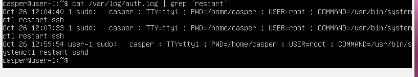

## Part 15. Использование планировщика заданий **CRON**

1. Добавляем задание в cron:

`crontab -e`

Добавляем строку `*/2 * * * * uptime` в конец файла.

2. Ищем в журнале строчки о выполнении:

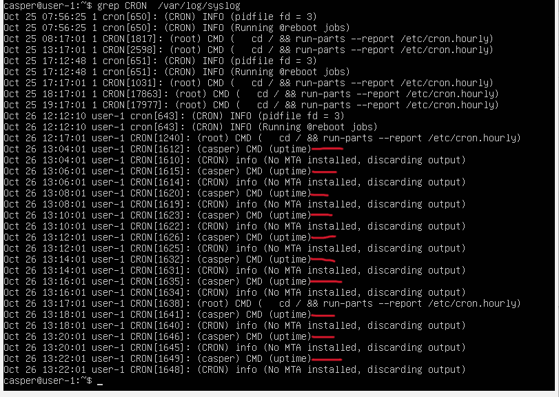

3. Удаление всех заданий:

`crontab -r`

